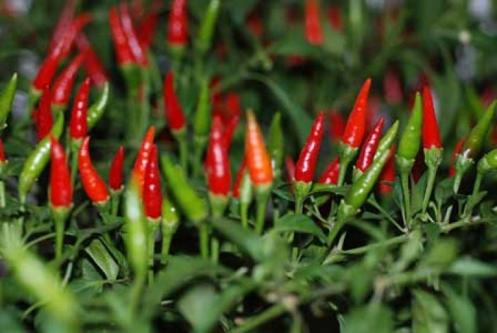
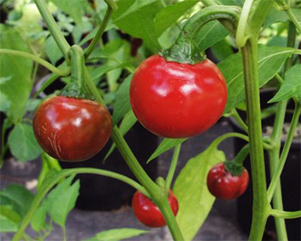
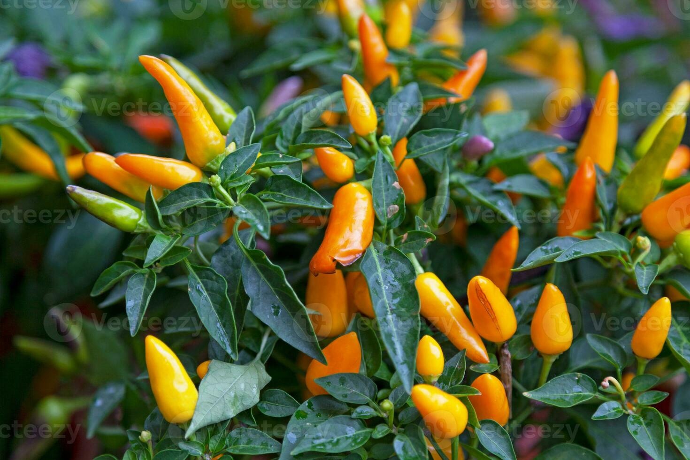
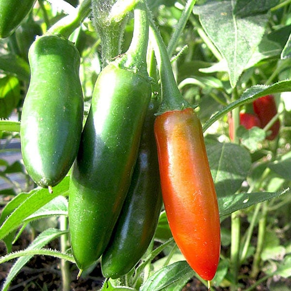
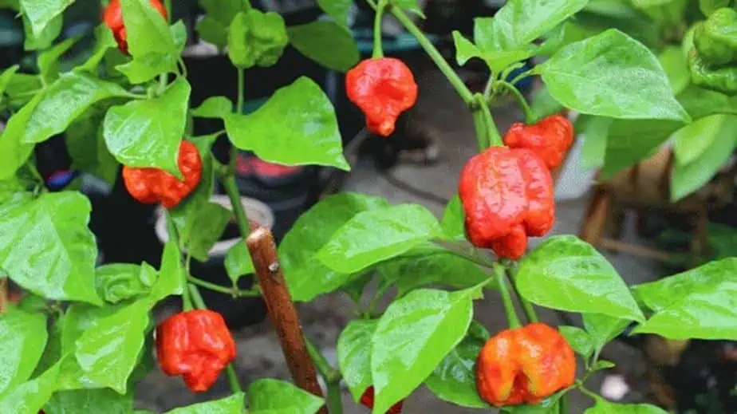
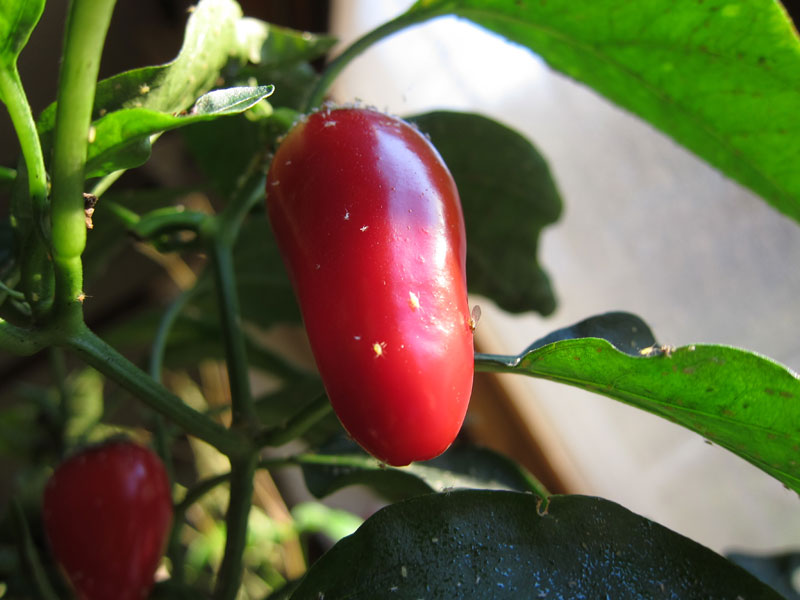
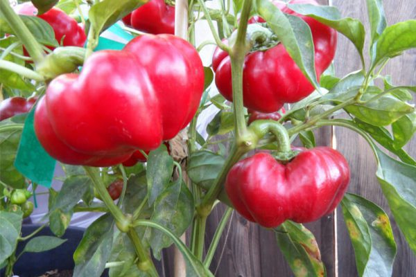

## Aji Peppers

Common Name: Aji 
Scientific Name: Chili Peppers

Description: Aji is a type of chili pepper plant known for its bright-colored fruits and spicy taste. It is commonly grown in warm climates and is widely used in cooking, sauces, and seasonings. The plant produces small to medium-sized peppers that usually change color from green to yellow, orange, or red as they ripen. Aji chili peppers are popular because they add strong flavor and heat to different dishes.

## Bolivian Rainbow

Common Name: Bolivian Rainbow Chili
Scientific Name: Capsicum annuum

Description:
Bolivian Rainbow is an ornamental chili pepper plant known for its colorful fruits that change from purple to yellow, orange, and red as they ripen. It is small, compact, and commonly grown in gardens or pots. The peppers are spicy and can also be used in cooking.

## Brain Strain

Common Name: Brain Strain Pepper
Scientific Name: Capsicum chinense

Description:
Brain Strain is a very hot chili pepper variety known for its wrinkled and bumpy surface that resembles a brain. It is commonly used to make spicy sauces and chili powders. The plant produces bright-colored peppers with extreme heat levels.

## Capsicum Frutescens

Common Name: Tabasco / Bird’s Eye Chili
Scientific Name: Capsicum frutescens

Description:
Capsicum frutescens is a chili pepper species known for producing small, upright, and very spicy fruits. It is widely cultivated in tropical regions and commonly used in sauces, seasonings, and spicy dishes.

##Capsicum Peppers

Common Name: Capsicum Pepper
Scientific Name: Capsicum spp.

Description:
Capsicum peppers refer to different varieties of chili and bell peppers under the Capsicum genus. These plants are popular worldwide for their spicy to mild fruits. They are commonly used in cooking, seasoning, and food production.

## Cascabel

Common Name: Cascabel Pepper
Scientific Name: Capsicum annuum

Description:
Cascabel is a round chili pepper known for its rattling sound when dried because the seeds become loose inside. It has a mild to medium heat level and is commonly used in Mexican dishes, sauces, and soups.

## Cayenne Golden

Common Name: Golden Cayenne Pepper
Scientific Name: Capsicum annuum

Description:
Golden Cayenne is a chili pepper variety known for its long yellow-golden fruits. It has a medium to hot spice level and is commonly used fresh, dried, or powdered. It adds strong heat and flavor to dishes.

## Cherry Peppers

Common Name: Cherry Pepper
Scientific Name: Capsicum annuum

Description:
Cherry peppers are small, round peppers that resemble cherries. They can be sweet or spicy depending on the variety. These peppers are commonly used in salads, pickles, and stuffing recipes.

## Chilca Peppers

Common Name: Chilca Pepper
Scientific Name: Capsicum spp.

Description:
Chilca peppers are chili varieties known in some regions for their strong flavor and spice. They are commonly used in local dishes and sauces. The plant produces small to medium peppers that are used fresh or dried.

## Chilchucle Amarillo

Common Name: Chilchucle Amarillo
Scientific Name: Capsicum annuum

Description:
Chilchucle Amarillo is a yellow chili pepper variety known for its unique smoky flavor and moderate heat. It is commonly used in traditional Mexican sauces and mole dishes. The pepper is often dried before use.

## Chocolate Habanero

Common Name: Chocolate Habanero
Scientific Name: Capsicum chinense

Description:
Chocolate Habanero is a very hot chili pepper variety with dark brown fruit when ripe. It has a smoky and fruity flavor, making it popular for hot sauces and spicy recipes. It is known for its intense heat.

## Doux de Landes

Common Name: Doux de Landes Pepper
Scientific Name: Capsicum annuum

Description:
Doux de Landes is a mild pepper variety from France. It is known for its sweet flavor and low heat level. It is often used in salads, cooking, and roasting.

## Elephants Ear

Common Name: Elephant’s Ear Pepper
Scientific Name: Capsicum annuum

Description:
Elephant’s Ear is a pepper variety known for its large, wide fruits that resemble an elephant’s ear. It is usually mild and commonly used for stuffing, roasting, and cooking. The plant produces thick-fleshed peppers.

## Hidalgo

Common Name: Hidalgo Chili Pepper
Scientific Name: Capsicum annuum

Description:
Hidalgo is a chili pepper variety known for its strong heat and bold flavor. It is commonly used in sauces and spicy dishes. The plant produces medium-sized peppers that can be used fresh or dried.

## Infinity

Common Name: Infinity Chili Pepper
Scientific Name: Capsicum chinense

Description:
Infinity chili pepper is a hot variety known for its intense spiciness and strong aroma. It is often used in making spicy sauces and powders. The plant produces small wrinkled peppers that ripen to bright colors.

## Jalapeño

Common Name: Jalapeño Pepper
Scientific Name: Capsicum annuum

Description:
Jalapeño is a popular medium-heat chili pepper used worldwide. It is commonly eaten fresh, pickled, or smoked (chipotle). The plant produces green peppers that turn red when fully ripe.

## Liebesapfel

Common Name: Liebesapfel Pepper
Scientific Name: Capsicum annuum

Description:
Liebesapfel is a pepper variety known for its unique shape and mild to moderate heat. It is often grown in gardens for culinary use. The plant produces colorful peppers that can be used fresh or cooked.

## Long Green Chili

Common Name: Long Green Chili Pepper
Scientific Name: Capsicum annuum

Description:
Long green chili peppers are widely used in Asian cooking. They have a mild to medium heat level and are often used in stir-fries, soups, and sauces. The peppers are long, thin, and green when harvested.

## Redhot Cherry

Common Name: Red Hot Cherry Pepper
Scientific Name: Capsicum annuum

Description:
Red Hot Cherry is a round chili pepper variety with bright red fruit and spicy flavor. It is often used for pickling, stuffing, and cooking. The plant produces small peppers that ripen into a deep red color.

## Thai Chili

Common Name: Thai Chili Pepper
Scientific Name: Capsicum frutescens

Description:
Thai chili is a small but very spicy pepper widely used in Thai and Southeast Asian dishes. It is known for its strong heat and sharp flavor. The peppers are commonly used fresh, dried, or in chili paste.
